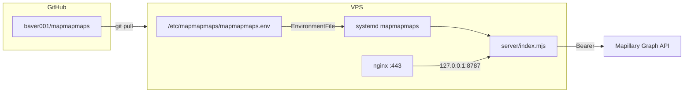

# Деплой MapMapMaps на VPS

Production: **nginx** → **Node** (`server/index.mjs`) → статика + `/api/mapillary`.

Токен Mapillary **никогда не в git**. Живёт только в файле на сервере или в секретах CI (см. ниже).

## Архитектура секрета



**Рекомендуемый вариант (простой):** один раз вручную положить токен в `/etc/mapmapmaps/mapmapmaps.env`, дальше деплой только `git pull` + `systemctl restart` — секрет не трогаем.

**Вариант с CI:** GitHub Secret `MAPILLARY_ACCESS_TOKEN` + SSH deploy — скрипт при деплое перезаписывает env-файл (удобно при смене токена, но секрет дублируется в GitHub).

## 1. Подготовка сервера (один раз)

```bash
sudo apt update
sudo apt install -y git nginx certbot python3-certbot-nginx

sudo mkdir -p /var/www/mapmapmaps
sudo chown "$USER":"$USER" /var/www/mapmapmaps

git clone https://github.com/baver001/mapmapmaps.git /var/www/mapmapmaps
cd /var/www/mapmapmaps
```

Node.js **18+** (лучше 20+):

```bash
node -v   # v20.x
```

## 2. Токен Mapillary (один раз)

На VPS, **не** в репозитории:

```bash
cd /var/www/mapmapmaps
sudo bash deploy/vps/setup-secret.sh 'MLY|YOUR_CLIENT_ID|YOUR_TOKEN'
```

Или вручную:

```bash
sudo mkdir -p /etc/mapmapmaps
sudo cp deploy/vps/mapmapmaps.env.example /etc/mapmapmaps/mapmapmaps.env
sudo nano /etc/mapmapmaps/mapmapmaps.env   # вставить реальный токен
sudo chmod 600 /etc/mapmapmaps/mapmapmaps.env
sudo chown root:root /etc/mapmapmaps/mapmapmaps.env
```

Проверка локально на сервере:

```bash
export $(grep -v '^#' /etc/mapmapmaps/mapmapmaps.env | xargs)
node server/index.mjs
curl -s "http://127.0.0.1:8787/api/mapillary?action=stats"
```

## 3. systemd

```bash
sudo cp deploy/vps/mapmapmaps.service /etc/systemd/system/mapmapmaps.service
# Проверьте User= и пути в unit-файле под ваш VPS
sudo systemctl daemon-reload
sudo systemctl enable --now mapmapmaps
sudo systemctl status mapmapmaps
```

## 4. nginx + TLS

```bash
sudo cp deploy/vps/nginx-mapmapmaps.conf.example /etc/nginx/sites-available/mapmapmaps
sudo ln -sf /etc/nginx/sites-available/mapmapmaps /etc/nginx/sites-enabled/
sudo nginx -t
sudo certbot --nginx -d mapmapmaps.com -d www.mapmapmaps.com
sudo systemctl reload nginx
```

## 5. Обновление после push в GitHub

На сервере:

```bash
cd /var/www/mapmapmaps
git pull origin main
sudo systemctl restart mapmapmaps
```

Или из CI: workflow `.github/workflows/deploy-vps.yml` (SSH + pull + restart). Секрет Mapillary в CI **не обязателен**, если env-файл уже на VPS.

## Локальная разработка

| Среда | Токен |
|--------|--------|
| `npm run dev` (Wrangler) | `.dev.vars` |
| `npm start` (VPS-like) | `.dev.vars` или `MAPILLARY_ACCESS_TOKEN` |

```bash
cp .dev.vars.example .dev.vars
# отредактировать токен
npm start
# http://127.0.0.1:8787
```

## Seeds

После смены токена или для пополнения пула:

```bash
cd /var/www/mapmapmaps
export $(grep -v '^#' /etc/mapmapmaps/mapmapmaps.env | xargs)
npm run seeds
sudo systemctl restart mapmapmaps
```

`data/seeds.json` коммитится в git — на VPS достаточно `git pull`.

## Безопасность

- Не коммитить `.dev.vars`, не логировать токен.
- `mapmapmaps.env`: права `600`, владелец root (или отдельный deploy-user без shell login).
- Node слушает **127.0.0.1** — снаружи только nginx.
- Токен всё равно уходит клиенту через `?action=config` (требование Mapillary JS SDK) — это client token, не server secret уровня billing.

## Cloudflare Pages

Опционально для preview; production у вас на VPS — см. `SECRETS_SETUP.md` (Wrangler) только если нужен.
