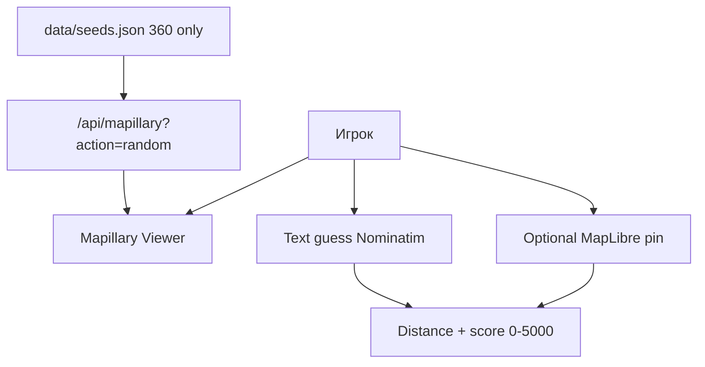

# Карта проекта — MapMapMaps

## Идея

Бесплатный GeoGuessr-like: случайная **Mapillary 360°** панорама → клик по карте OSM → очки. Без аккаунта и без платных API.

Режим зрелости: **MVP**.

## Устройство

- UI v2: HUD (progress dots, round/score pills), compact dock, fullscreen map sheet, result card, toast
- UI: `index.html`, `script.js`, `css/style.css` — Mapillary Viewer + text guess + optional MapLibre
- Seeds: `data/seeds.json` (~1842 точек, только `is_pano` / spherical), билдер `npm run seeds`
- API: `functions/api/mapillary.js` (Wrangler) или `server/index.mjs` (VPS)
- Текст guess: Nominatim; карта: MapLibre + OpenFreeMap
- Деплой production: **VPS** — `DEPLOY_SIMPLE.md` (push → GitHub Secrets → auto)

## Статусы

### Готово

- i18n: 9 языков (en, ru, es, de, fr, pt, zh, ja, ko), авто по `navigator.languages`
- SFX: Web Audio (шаг, звёзды, финиш), кнопка 🔊 слева над Donate
- HUD: трек прогресса под логотипом, счёт справа
- UI v2: dock, map sheet, result modal, toast, keyboard (Enter/M/Esc)
- Primary source: Mapillary 360° only
- Random из seed DB (+ live fallback)
- Основной guess: название места текстом (+ autocomplete)
- Опциональный guess: pin на MapLibre
- 5 раундов, экспоненциальный score
- PWA shell, Cloudflare Functions, $0 stack

### Дальше

- Больше seeds (`npm run seeds` периодически)
- Фильтры региона / сложности
- Опциональный Panoramax Europe mode

### Проверить

- Покрытие seeds вне крупных городов
- Стабильность Mapillary Viewer + rate limits при обновлении seeds

## Решения

- **Mapillary, не Panoramax** — больше мировых 360° для GeoGuessr-feel.
- Только сферические кадры (`is_pano` / spherical).
- Seed DB вместо хабов в рантайме — быстрее и разнообразнее.
- Google Street View не используем (платно).

## Экономика

- $0: Mapillary free token, OSM tiles, Nominatim не нужен в основном лупе, CF Pages free.
- Метрика: завершённый раунд с guess (текст или pin).

## Данные

- Secret: `MAPILLARY_ACCESS_TOKEN` (`.dev.vars` / pages secret)
- Score в `localStorage`
- Seeds без секретов, коммитятся в репо
